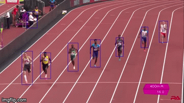

# people_tracker_cpp

This people detector is based on the tutorials https://www.learnopencv.com/object-tracking-using-opencv-cpp-python/ and https://www.learnopencv.com/deep-learning-based-object-detection-using-yolov3-with-opencv-python-c/. 

Here is used OPENCV C++ framework to develop a people tracker. Each N frames is used an object detector for detect people in the frame (YOLO V3) and  a multitracking algorithm is applied by N-1 frames between.

For download the weights and YOLO model  from darknet:

```
sudo chmod a+x getModels.sh
./getModels.sh
```

Then, for compile:

```
mkdir build
cd make
cmake .. 
make
```




Run multi tracking: 
```
./PEOPLE_TRACKER --video=video.mp4
```

 
